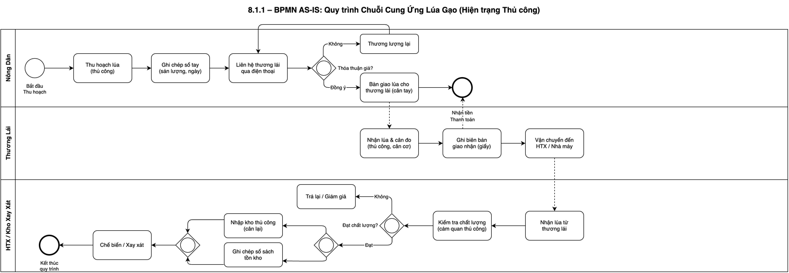
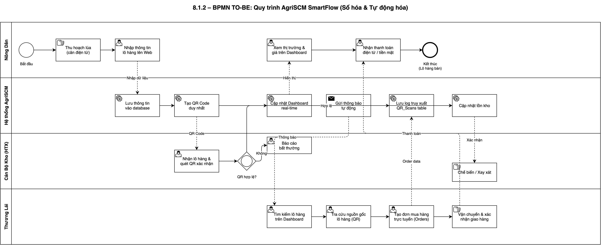
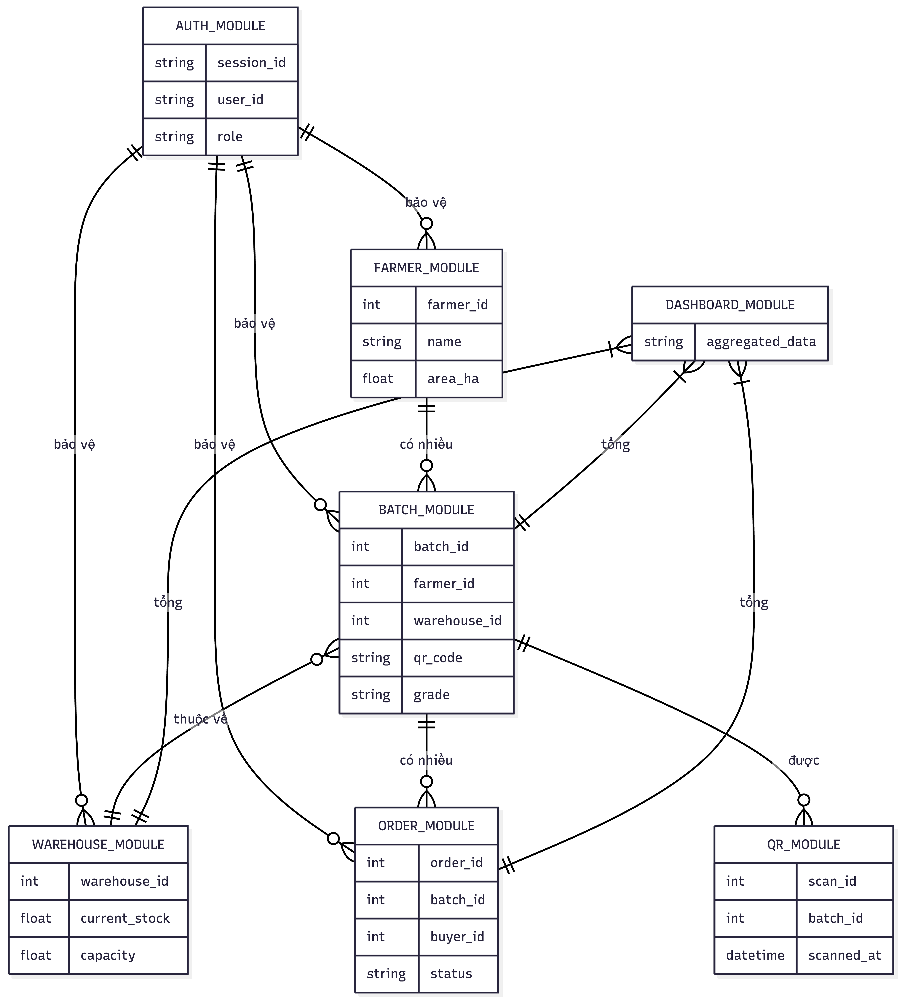
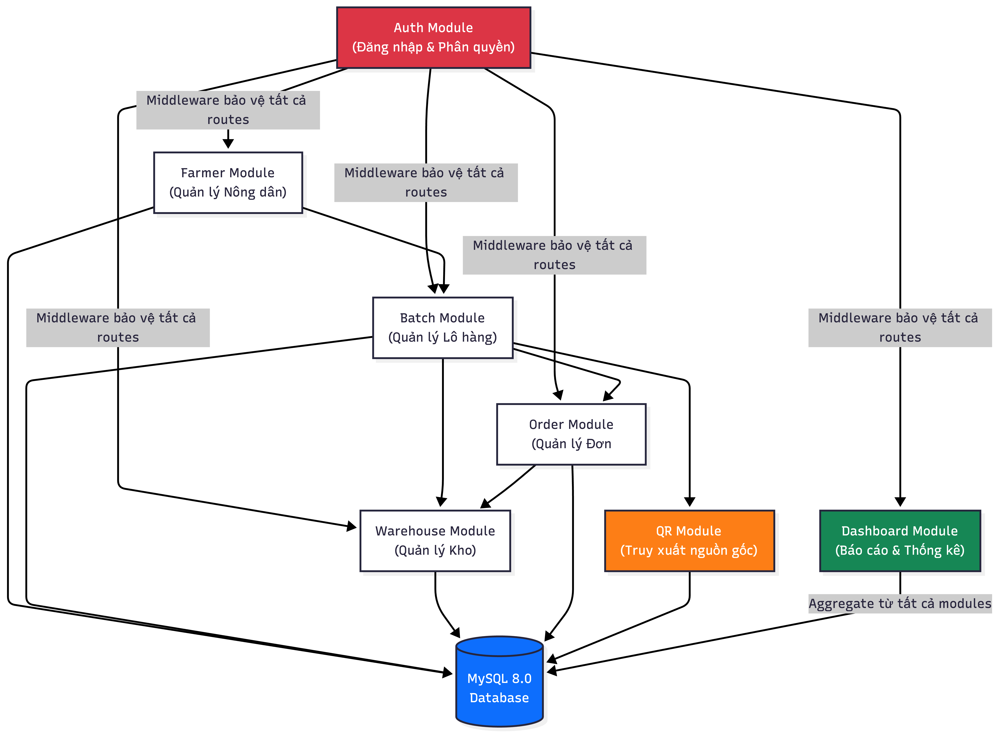
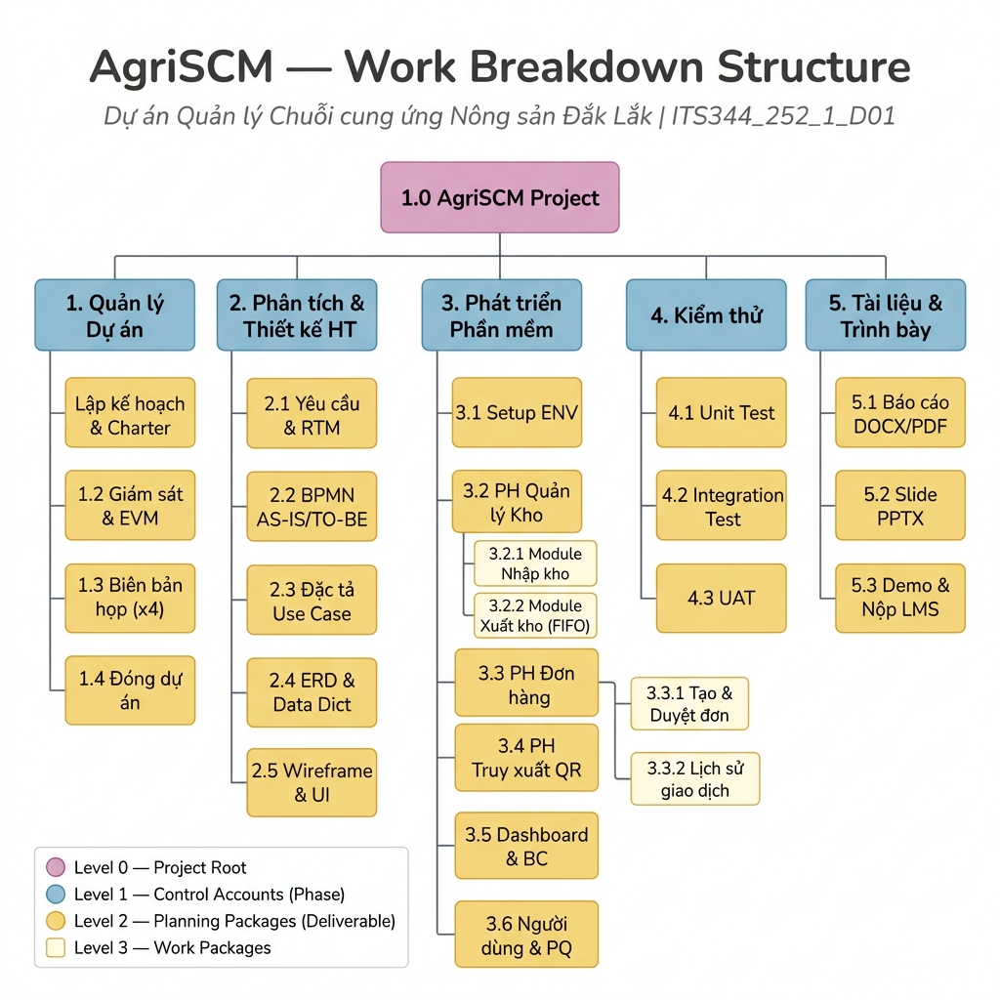
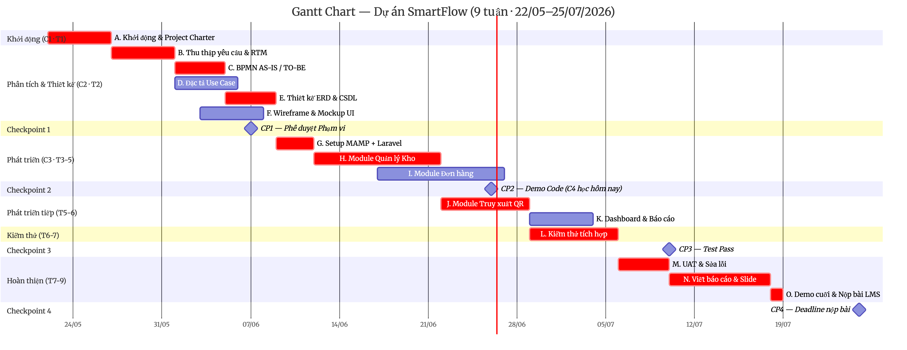

# 🌾 SmartFlow — AgriSCM

<div align="center">

**Hệ thống Quản lý Chuỗi cung ứng Nông sản tích hợp Truy xuất nguồn gốc QR**

[](https://sangminhnguyen210.atlassian.net/wiki/spaces/SW/)
[](https://sangminhnguyen210.atlassian.net/jira/software/projects/SF/boards)
[](https://sangminhnguyen210.atlassian.net/wiki/spaces/SW/)
[](https://laravel.com)
[](https://mysql.com)
[](https://php.net)

</div>

---

## 🎬 Truy cập nhanh 

| 🔗 Link | 📝 Mô tả |
|---|---|
| 🌐 **[Confluence Project Hub](https://sangminhnguyen210.atlassian.net/wiki/spaces/SW/)** | Toàn bộ tài liệu dự án theo 8 chương PMBOK |
| 📊 **[Jira Board](https://sangminhnguyen210.atlassian.net/jira/software/projects/SF/boards)** | Quản lý công việc thực tế — Epics & Tasks 

---

## 📖 Bối cảnh & Vấn đề kinh doanh

Khu vực **Buôn Triết, Lắk, Đắk Lắk** sản xuất các giống lúa đặc sản cao cấp (ST24, Đài Thơm 8) nhưng đang đối mặt với **4 Pain Points nghiêm trọng**:

| # | Pain Point | Hậu quả |
|---|---|---|
| PP-01 | Không truy xuất được nguồn gốc | Nông sản bị trà trộn hàng kém chất lượng |
| PP-02 | Thất thoát trong khâu kho bãi | Thiệt hại ≥ 5–8% sản lượng mỗi vụ |
| PP-03 | Thông tin giá cả thiếu minh bạch | Nông dân bị ép giá |
| PP-04 | Quy trình thủ công, giấy tờ | Mất thời gian, dễ sai sót, không truy vết |

**SmartFlow** giải quyết tất cả 4 vấn đề trên bằng nền tảng web-based tích hợp QR code truy xuất nguồn gốc.

---

## 🏗️ Kiến trúc Hệ thống

```
┌─────────────────────────────────────────────────────────┐
│                    SmartFlow AgriSCM                    │
├──────────────┬────────────────┬────────────┬────────────┤
│  📦 Quản lý  │  🚚 Quản lý   │  📊 Kho &  │  🔍 Truy  │
│  Nông hộ &   │  Đơn hàng &   │  Tồn kho   │  xuất QR  │
│  HTX         │  Thương lái   │  real-time │  Nguồn gốc│
├──────────────┴────────────────┴────────────┴────────────┤
│              📋 Dashboard & Báo cáo PDF                  │
├─────────────────────────────────────────────────────────┤
│  Laravel 10 (MVC)  │  MySQL 8.0  │  Bootstrap 5         │
└─────────────────────────────────────────────────────────┘
```

**5 Phân hệ chính:**
1. **Quản lý Nông hộ & HTX** — Đăng ký, hồ sơ, quản lý thành viên
2. **Quản lý Đơn hàng** — Tạo đơn, phê duyệt, theo dõi giao dịch
3. **Kho bãi & Tồn kho** — Nhập/xuất kho, cảnh báo ngưỡng tồn kho
4. **QR Truy xuất nguồn gốc** — Sinh QR tự động, quét → xem hành trình lô hàng
5. **Báo cáo & Dashboard** — Thống kê real-time, xuất PDF

---

## 🛠️ Tech Stack

| Lớp | Công nghệ | Phiên bản |
|---|---|---|
| Backend Framework | PHP Laravel (MVC) | 10.x |
| Database | MySQL | 8.0 |
| Frontend | HTML, CSS, Bootstrap | 5.3 |
| Auth | Laravel Sanctum | — |
| QR Generation | `simplesoftwareio/simple-qrcode` | — |
| PDF Export | DomPDF / `barryvdh/laravel-dompdf` | — |
| Deployment | Railway.app | — |
| PM Tools | Jira + Confluence + GitHub | — |

---

## 👥 Đội ngũ & Phân công PMBOK

| # | Thành viên | Vai trò | Trách nhiệm chính |
|---|---|---|---|
| 1 | **Nguyễn Minh Sang** | Project Manager / System Analyst | PM tổng thể, C1+C2+C4+C8 |
| 2 | **Đỗ Duy Thiên** | Business Analyst / QC | C2 yêu cầu, C6 truyền thông, C7 |
| 3 | **Tống Bình Minh** | UI/UX Designer / Frontend | C5 nhân lực, design system |
| 4 | **Đặng Phương Nam** | Senior Backend Developer | C3 lịch trình, database, API |
| 5 | **Trần Anh Duy** | Junior Backend Dev / DevOps | C6 rủi ro, deployment |

---

## 📁 Cấu trúc Thư mục

```
SmartFlow-ITS344/
├── README.md                  ← Trang landing page này
├── docs/
│   ├── 01_Project_Charter/    ← C1: Tích hợp & Project Charter
│   ├── 02_Scope_Management/   ← C2: Quản lý Phạm vi
│   ├── 03_Schedule_Management/← C3: Quản lý Thời gian
│   ├── 04_Cost_Resource/      ← C4: Quản lý Chi phí
│   ├── 05_Quality_Comms/      ← C5: Chất lượng & Nhân lực
│   ├── 06_Risk_Stakeholders/  ← C6: Rủi ro & Truyền thông
│   ├── 07_System_Design/      ← C7–C8: Thiết kế Hệ thống
│   └── report/                ← Báo cáo DOCX/PDF chính thức
├── assets/
│   ├── diagrams/              ← BPMN, ERD, Architecture, PDM...
│   └── mockups/               ← Wireframes & UI mockups
```

---

## 📊 Sơ đồ & Tài liệu

<table>
<tr>
<td align="center"><strong>BPMN As-Is</strong><br/>Quy trình thủ công hiện tại</td>
<td align="center"><strong>BPMN To-Be</strong><br/>Quy trình sau khi có SmartFlow</td>
</tr>
<tr>
<td></td>
<td></td>
</tr>
</table>

<table>
<tr>
<td align="center"><strong>ERD — Module Interactions</strong></td>
<td align="center"><strong>Module Architecture</strong></td>
</tr>
<tr>
<td></td>
<td></td>
</tr>
</table>

<table>
<tr>
<td align="center"><strong>WBS Overview</strong></td>
<td align="center"><strong>Biểu đồ Gantt (16 tuần)</strong></td>
</tr>
<tr>
<td></td>
<td></td>
</tr>
</table>

---

## 📚 Tài liệu đầy đủ

Toàn bộ tài liệu dự án (8 chương, theo PMBOK 6th Edition) được tổ chức tại:

👉 **[Confluence Project Hub — SmartFlow Wiki](https://sangminhnguyen210.atlassian.net/wiki/spaces/SW/)**

| Chương | Nội dung | Trang Confluence |
|---|---|---|
| C1 | Tích hợp & Project Charter | [→ Xem](https://sangminhnguyen210.atlassian.net/wiki/spaces/SW/) |
| C2 | Quản lý Phạm vi (Scope) | [→ Xem](https://sangminhnguyen210.atlassian.net/wiki/spaces/SW/) |
| C3 | Quản lý Thời gian (Schedule + EVM) | [→ Xem](https://sangminhnguyen210.atlassian.net/wiki/spaces/SW/) |
| C4 | Quản lý Chi phí (Cost) | [→ Xem](https://sangminhnguyen210.atlassian.net/wiki/spaces/SW/) |
| C5 | Chất lượng & Nguồn Nhân lực | [→ Xem](https://sangminhnguyen210.atlassian.net/wiki/spaces/SW/) |
| C6 | Rủi ro & Truyền thông | [→ Xem](https://sangminhnguyen210.atlassian.net/wiki/spaces/SW/) |
| C7 | Mua sắm & Các Bên liên quan | [→ Xem](https://sangminhnguyen210.atlassian.net/wiki/spaces/SW/) |
| C8 | Phân tích & Thiết kế Hệ thống | [→ Xem](https://sangminhnguyen210.atlassian.net/wiki/spaces/SW/) |

---

## 📋 Thông tin Dự án

| Thông tin | Chi tiết |
|---|---|
| **Tên dự án** | SmartFlow — AgriSCM |
| **Học phần** | ITS344 — Quản trị Dự án Hệ thống Thông tin |
| **Lớp** | ITS344_252_1_D01 |
| **Học kỳ** | HK2 — 2025/2026 |
| **Phương pháp PM** | PMBOK 6th Edition (Predictive/Waterfall) |
| **Thời gian dự án** | 16 tuần (T1/2025 – T4/2025) |
| **Ngân sách ước tính** | 46.880.000 VNĐ |

---

## 📂 Tài nguyên chi tiết (từ Báo cáo chính thức)

Các bảng và tài liệu chuyên sâu từ báo cáo đã được chuyển đổi sang Markdown để dễ tham chiếu:

| Tài liệu | Mô tả |
|---|---|
| [activity_list_pert_schedule.md](docs/activity_list_pert_schedule.md) | Danh sách 15 hoạt động, PERT, CPM & Đường tới hạn |
| [cost_estimation_evm.md](docs/cost_estimation_evm.md) | Ước lượng chi phí WP Level, Cost Baseline & EVM Checkpoint 2 |
| [raci_matrix_org_chart.md](docs/raci_matrix_org_chart.md) | Ma trận RACI 9 deliverable × 5 thành viên & Org Chart |
| [risk_register.md](docs/risk_register.md) | Risk Register 8 rủi ro với P×I Score & Chiến lược ứng phó |
| [VIDEO_DEMO_SCRIPT.md](docs/VIDEO_DEMO_SCRIPT.md) | Kịch bản Video Demo 4m30s |
| [EMAIL_NOP_BAI_TEMPLATE.md](docs/EMAIL_NOP_BAI_TEMPLATE.md) | Template Email nộp bài chuyên nghiệp |


---

<div align="center">
<sub>SmartFlow — ITS344_252_1_D01 — Nhóm Nguyễn Trường Sang</sub>
</div>
